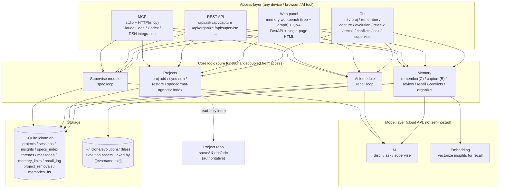

# 🧠 L-clone — External Brain

> [中文](README.zh-CN.md) | `English`

[](LICENSE)

**L-clone** is a personal external brain: it records what you've done, and recalls your memory and checks the boundary conditions of your proposals when you plan what's next.

## What it does

- **Layered memory**: session stream (L0) → insights (L1) → project spec index (L2)
- **Insight, not raw recording**: every memory is an **atomic, self-contained knowledge card** (a decision / an experience / an observation / a lesson) written in a 4-segment form — *point ｜ background/why ｜ impact/what to watch for ｜ attribution* — so each is independently readable
- **Recall loop**: new sessions automatically recall related insights and answer "where did I leave off / what did we decide"
- **Spec loop**: new proposals are checked against a project spec's boundary conditions, producing a ✅ pass / ⚠️ warn / ❌ fail report
- **Write modes**: automatic capture (B, AI distills → you confirm) and active memory (C, your call); **insights take effect only after you approve them** — every entry is traceable to its source
- **Evolution assets**: reusable scripts / tools live as **files** under `~/.lclone/evolutions/` (not in the DB); an insight points to one with `[[evo:name.ext]]`
- **Admission & organization**: code-enforced filtering of "what was done" (goes to git/spec, not the brain), **conflict detection** between insights, and an `organize` action that merges semantically-similar insights in one click
- **Two-axis vertical layering**: global → project; concrete work stays in the repo, the brain only tracks direction and decisions
- **Multi-client**: CLI + Web panel + REST API + MCP (Claude Code / Codex / DSH plugin), wired up via a single `install` wizard

## The problem it solves

Models are stateless: in the next conversation, the AI doesn't remember your last decisions, your project boundaries, or your specs.
L-clone settles "what you did, what you decided, what the constraints are" into durable memory and injects it into every new session, so the AI's next steps build on *your previous decisions* instead of starting from scratch each time.

## Architecture overview

L-clone separates the **access layer** (CLI / Web / REST API / MCP) from the **core logic** (memory, projects, ask, supervise — pure functions) and the **storage & model layers**:



> With `BRAIN_LLM=dummy` the model layer is replaced by a built-in offline backend — no network and no API key needed.

See [docs/CONCEPTS.md](docs/CONCEPTS.md) for the data model (ER), the write/recall/spec flows, and the design rationale.

## Dependencies

| Item | Requirement |
|---|---|
| **Python** | **>= 3.10** (no GPU required) |
| **Third-party libs** | `openai` (>=1.30) / `fastapi` (>=0.110) / `uvicorn` (>=0.29) / `questionary` (>=2.0, interactive menus) |
| **Database** | SQLite (built-in, nothing to install) |
| **Network** | The model API must be reachable at `BRAIN_BASE_URL`; use the Tsinghua mirror for installing dependencies in China |
| **Offline mode** | `BRAIN_LLM=dummy`: zero third-party deps, no API key needed, full feature experience |

Install:

```bash
python -m venv .venv
# Windows: .venv\Scripts\python.exe -m pip install -r requirements.txt -i https://pypi.tuna.tsinghua.edu.cn/simple
.venv/bin/python -m pip install -r requirements.txt -i https://pypi.tuna.tsinghua.edu.cn/simple
```

> Tip: use `python -m pip` rather than `.venv\Scripts\pip` — the latter is a launcher that breaks when the venv is moved or renamed (`Fatal error in launcher`).

> Deploy the backend with **`lclone setup`** (pick a provider + enter a key → generates `.env`, initializes the database, **start from an empty project**); it does not register projects or touch any AI-tool frontend. To hook up Claude Code / Codex / DSH, use **`lclone integrate`**. See [docs/CLI.md](docs/CLI.md).

## How to use

### One-click experience (offline, 3 minutes, zero deps)

```powershell
powershell -ExecutionPolicy Bypass -File .\scripts\demo_offline.ps1
```

### One-click deploy (recommended)

```bash
# Local (Windows / macOS / Linux): create venv + install deps + setup wizard + self-check + start web
python scripts/deploy_local.py            # interactive: pick provider + enter key
python scripts/deploy_local.py --offline  # offline mode, zero deps, zero key
python scripts/deploy_local.py --mirror   # use the Tsinghua mirror in China

# Server (Linux + Docker): generate .env interactively → docker compose up -d --build → health check
./scripts/deploy_server.sh
```

### Manual workflow

**Step 1 — get it running offline first** (no API key):

```powershell
$env:BRAIN_LLM = "dummy"        # offline mode
python -m lclone init
python -m lclone proj add demo examples/demo_project --charter "示例项目"
python -m lclone proj sync demo          # scan and index the spec files in the project
python -m lclone remember "后端用 FastAPI, 边界: 单用户" --project demo
#   ↑ insights go to pending by default; add --confirmed to apply immediately, or confirm later with review
python -m lclone capture "讨论后确定: 6月1日上线" --project demo
python -m lclone review --all keep       # confirm drafts (or interactive: lclone review)
python -m lclone recall "FastAPI" --project demo
python -m lclone supervise "把数据库换成 PostgreSQL" --project demo
python -m lclone conflicts               # find contradictory insight pairs (needs a real LLM)
python -m lclone ask "我们项目定了什么?" --project demo
```

> Note: `remember` only writes **insights** (there is no longer a separate `note` level — process fact-records were folded into the evolution / git-side). To register a reusable script/tool, use `lclone evolution add`.

**Step 2 — hook up a real model API + the Web panel**:

```powershell
python -m lclone setup              # deploy backend: pick provider + enter key, auto-writes .env (recommended)
# or manually: Copy-Item .env.example .env, fill in OPENAI_API_KEY / BRAIN_BASE_URL / model name (see docs/CLI.md)
python -m lclone doctor --check-llm  # self-check the integration
.\.venv\Scripts\python.exe -m lclone web    # open http://127.0.0.1:8000 in a browser
# run in background: lclone serve start / stop / status / restart
# hook up Claude Code / Codex / DSH etc. (optional, separate command): lclone integrate
```

### Recording a conversation with Claude/AI

Paste the conversation into the brain and it automatically extracts an insight (goes to drafts, active after you confirm):

```powershell
lclone capture "我想做个健身记录工具。Claude 建议: 用 Python + SQLite, 每周自动汇总, 先跑通再优化。我同意, 定于下月 1 号上线。"
lclone review --all keep        # confirm the insight drafts after you review them
lclone recall "健身工具"         # it comes back next time
```

Don't want to paste a long conversation? Have Claude output a one-line conclusion at the end, then:

```powershell
lclone remember "健身工具: Python+SQLite, 每周汇总, 下月1号上线" --confirmed   # insight already confirmed, applies immediately
```

> If you forget `--confirmed`, it's fine: unconfirmed insights go to pending, and `lclone review` stamps them later to the same effect.
> The Web panel's "Memory Workbench" → "Pending" button also handles this; once you integrate AI tools (`lclone integrate` configures MCP / DSH plugin / Claude Code hooks) there's no copy-pasting — it's captured automatically.

### Full self-test (no API key)

```bash
python tests/test_offline.py    # 90+ offline assertions, no API key
```

## Documentation index

| Doc | Content |
|---|---|
| [docs/CONCEPTS.md](docs/CONCEPTS.md) | Design rationale (layering, the two loops, insight confirmation, evolution), Mermaid diagrams (data model / write / recall / spec / vertical), ecosystem, roadmap |
| [docs/CLI.md](docs/CLI.md) | Full CLI reference, Web panel & REST API, model API config, environment variables |
| [docs/DEPLOYMENT.md](docs/DEPLOYMENT.md) | Server deployment (Docker + Caddy + security) and MCP over HTTP |

## License

[LICENSE](LICENSE) · **MIT License** · Copyright (c) 2026 ljzRober
