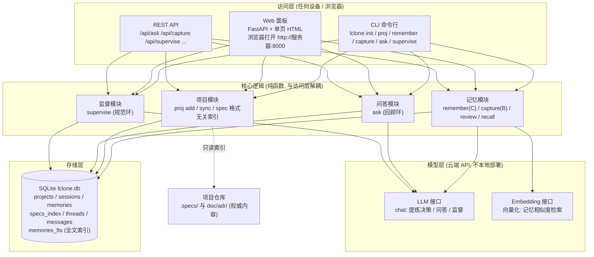
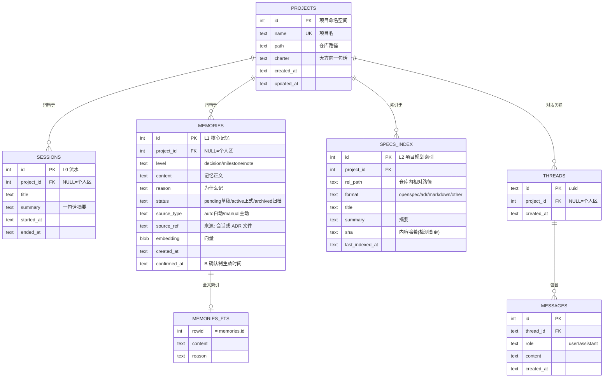
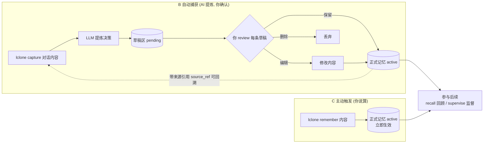
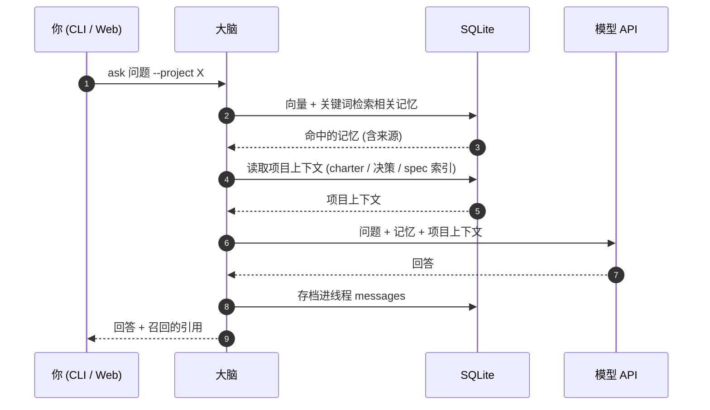
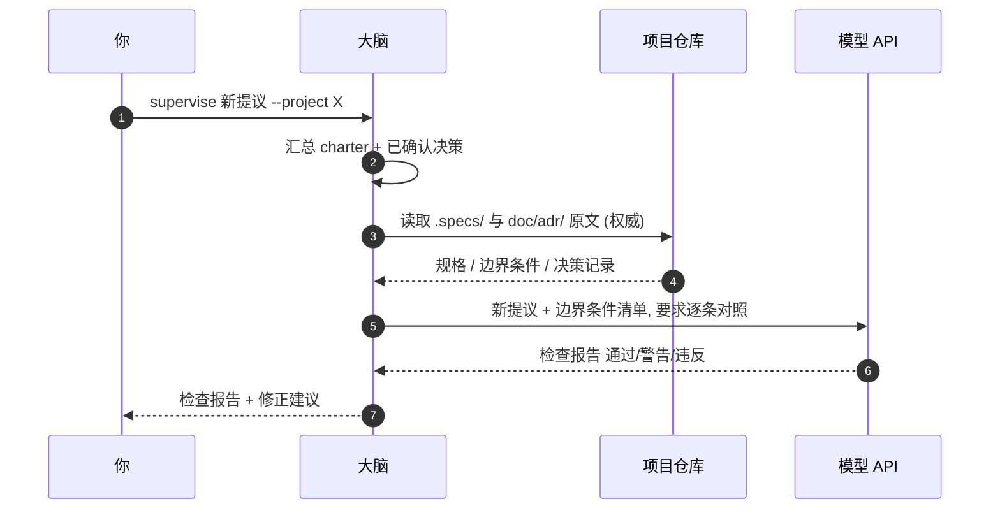
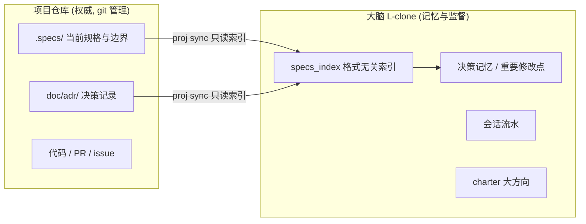

# 🧠 L-clone — 外置大脑 (External Brain)

一个**分层记忆 + 回顾环 + 规范环**的个人外置大脑:记录你做过什么,并在你
规划未来时调用记忆、监督方案的边界条件。

> v0 只做**大脑部分**:记忆、召回、监督。项目仓库内的具体事务
> (spec 全文、代码、PR)永远留在项目本身,大脑只建索引和记忆。

---

## 一、设计

### 横向分层(记忆等级 × 时间)

```
L0 流水层   sessions    每次工作一句话摘要 (自动记录, 零打扰)
L1 决策层   memories    决策 / 重要修改点 / 记录 (大脑的核心记忆)
L2 规划层   specs_index 项目内 spec 文件的索引 (权威内容在仓库)
```

### 竖向分层(项目维度)

- 每个项目一个命名空间 (`project_id`);`NULL` = 个人区
- **项目内**:spec/决策/代码留在仓库, 采用业界约定 (OpenSpec / ADR 等,
  格式可换——大脑按路径模式启发式识别, 不绑定任何工具)
- **大脑内**:只管理大方向 (charter)、决策记忆、重要修改点、跨项目召回

### 记忆写入策略(B + C)

```
C 主动触发 (lclone remember "…")   -> 直接生效, 你说算
B 自动捕获 (lclone capture "…")    -> LLM 提炼决策 -> pending 草稿区
                                      -> 你 review 确认/编辑/删除 -> 生效
```

每条记忆带来源引用 (`source_ref`), 可追溯。

### 两个回路

```
回顾环: 新会话 -> 召回相关记忆 + 项目上下文 -> 注入问答
规范环: 新提议 -> 调出项目 spec/边界 -> 逐条对照 -> ✅/⚠️/❌ 检查报告
```

## 二、整体架构

> 以下图表均为 Mermaid, 在 GitHub 上可直接渲染。

### 2.1 系统架构图



> `BRAIN_LLM=dummy` 时模型层由内置离线后端替代, 无需网络与 API Key。

### 2.2 数据存储结构 (ER 图)



### 2.3 记忆写入流程 (B 确认制 + C 主动触发)



### 2.4 回顾环 (新会话想起过去)



### 2.5 规范环 (新提议对照边界条件)



### 2.6 竖向分层: 大脑与项目的分工



> 具体事务 (spec 全文 / 代码 / PR) 永远留在项目仓库; 大脑只管大方向、
> 决策记忆、重要修改点, 并在监督时引用仓库原文。

## 三、环境要求与依赖

| 项 | 要求 | 说明 |
|---|---|---|
| **Python** | **>= 3.10** | 开发验证环境: Python 3.10.6 (Windows 10); **无需 GPU** |
| 操作系统 | Windows / Linux / macOS | |
| 第三方依赖 | `openai` / `fastapi` / `uvicorn` | 仅"模型 API"和"Web 面板"需要; **离线 CLI 零第三方依赖** |
| 数据库 | SQLite(内置, 无需安装) | 用 Python 自带 sqlite3; 版本 >= 3.34 自动启用 trigram 中文分词 |
| 网络 | 装依赖需外网; 模型 API 需能访问 `BRAIN_BASE_URL` | 国内装依赖推荐清华镜像; API 可走 DeepSeek / 硅基流动 / 智谱 |

### 依赖清单 (requirements.txt)

| 包 | 版本要求 | 用途 |
|---|---|---|
| `openai` | >= 1.30.0 | OpenAI 兼容 API 客户端(OpenAI / DeepSeek / 硅基流动 / 智谱 通用) |
| `fastapi` | >= 0.110.0 | Web 面板后端 |
| `uvicorn` | >= 0.29.0 | Web 服务器 |

**离线模式(`BRAIN_LLM=dummy`)只依赖 Python 标准库**: 不装任何第三方包也能完整体验
init / proj / remember / capture / review / recall / supervise / ask(输出为占位内容)。

### 快速安装依赖(国内网络推荐清华镜像)

```bash
python -m venv .venv
# Windows: .venv\Scripts\pip install -r requirements.txt -i https://pypi.tuna.tsinghua.edu.cn/simple
.venv/bin/pip install -r requirements.txt -i https://pypi.tuna.tsinghua.edu.cn/simple
```

## 四、快速开始

### 1. 本地实战(Windows PowerShell 为例)

**第 1 步 — 离线模式先跑通**(无需 API Key、无需装依赖, 3 分钟体验全功能):

```powershell
cd C:\customFile\github\L-clone
$env:BRAIN_LLM = "dummy"        # 离线模式
python -m lclone init
python -m lclone proj add demo examples/demo_project --charter "示例项目"
python -m lclone proj sync demo          # 扫描并索引项目里的 spec 文件
python -m lclone remember "后端用 FastAPI, 边界: 单用户" --project demo
python -m lclone capture "讨论后确定: 6月1日上线" --project demo
python -m lclone review --all keep    # 批量确认草稿 (或交互式: lclone review)
python -m lclone recall "FastAPI" --project demo
python -m lclone supervise "把数据库换成 PostgreSQL" --project demo
python -m lclone ask "我们项目定了什么?" --project demo
```

**第 2 步 — 接入真实模型 API**(需要一个 OpenAI 兼容服务的 Key):

```powershell
Copy-Item .env.example .env     # 编辑 .env: 填 OPENAI_API_KEY / BRAIN_BASE_URL / 模型名
python -m venv .venv
.\.venv\Scripts\pip install -r requirements.txt        # 国内可加 -i 清华镜像
.\.venv\Scripts\python.exe -m lclone web                # 启动 Web 面板
# 浏览器打开 http://127.0.0.1:8000
```

**第 3 步 — 以后部署到服务器**(见第七节): `docker compose up -d`

### 2. 记录与 Claude/AI 的对话(实战例子)

假设你用 Claude 讨论了一个小工具:

> **你**: 我想做个记录健身数据的工具
> **Claude**: 建议用 Python + SQLite, 每周自动汇总, 先跑通再优化
> **你**: 好, 就按这个来, 下月 1 号上线

**方式一: 把对话内容粘给大脑, 自动提炼决策**(推荐, 大脑只记"确定的结论", 不记闲聊)

```powershell
lclone capture "我想做个健身记录工具。Claude 建议: 用 Python + SQLite, 每周自动汇总, 先跑通再优化。我同意, 定于下月 1 号上线。" --title "健身工具需求讨论"
# 大脑的 LLM 提炼出决策草稿, 进入待确认区:
#   [pending] 采用 Python + SQLite 实现健身记录工具
#   [pending] 上线日期定为下月 1 号
#   [pending] 原则: 先跑通再优化
lclone review --all keep          # 你过目后确认, 转正式记忆
lclone recall "健身工具"           # 下次直接想起
```

**方式二: 让 Claude 自己总结, 再交给大脑**(省 token)

对话结束时让 Claude 输出一行结论, 复制后:

```powershell
lclone remember "健身工具: Python+SQLite, 每周汇总, 下月1号上线"   # C 主动触发, 直接生效
```

**方式三: Web 面板**(浏览器操作): 打开 Web 面板 → 「记忆」页签 →
把对话内容粘进"记录一段对话" → 「待确认」页签点保留。

> 原理: `capture` 用 LLM 从原始对话里提炼"确定的决策"(B 确认制),
> 避免把闲聊也记进去; `remember` 是你亲口说的, 直接生效(C 主动触发)。
> v1 接入 MCP 后, Claude Code 可自动调用这两个接口, 无需复制粘贴。

### 3. 完整自测(无需 API Key)

```bash
cd L-clone
python tests/test_offline.py          # 全量自测 (20 项)
```

### 4. 模型 API 配置参考

`BRAIN_BASE_URL` 可切任意 OpenAI 兼容服务:

| 服务 | BASE_URL | chat 模型示例 | embed 模型示例 |
|---|---|---|---|
| OpenAI | `https://api.openai.com/v1` | `gpt-4o-mini` | `text-embedding-3-small` |
| DeepSeek | `https://api.deepseek.com/v1` | `deepseek-chat` | (需配合其他 embed) |
| 硅基流动 | `https://api.siliconflow.cn/v1` | `Qwen/Qwen2.5-7B-Instruct` | `BAAI/bge-m3` |
| 智谱 | `https://open.bigmodel.cn/api/paas/v4` | `glm-4-flash` | `embedding-3` |

> 若 embed 模型不可用, 可把 `BRAIN_EMBED_MODEL` 指到任一兼容服务;
> 注意: 问答时检索到的记忆片段会随请求发给模型厂商(隐私边界)。

## 五、CLI 参考

```
lclone init                           初始化数据库
lclone proj add <name> [仓库路径] [--charter "大方向"]
lclone proj list / sync <id|name> / rm / show
lclone log "一句话摘要" [--project id]          # L0 流水
lclone remember "内容" [--level decision|milestone|note] [--project id]
lclone capture "本次工作内容" [--project id]     # B: 进草稿
lclone review [--id N --action keep|edit|delete --edit-new "…"] [--all keep|delete]
lclone recall "查询" [--project id] [--k 5]
lclone supervise "新提议" --project id           # 规范环
lclone ask "问题" [--project id] [--thread id]  # 回顾环
lclone web [--host 0.0.0.0] [--port 8000]
```

所有子命令可用 `--db <路径>` 指定数据库(前后均可)。

## 六、Web 面板

```bash
python -m lclone web
# 浏览器打开 http://127.0.0.1:8000
```

含问答、主动记忆、回顾检索、项目注册与 spec 同步、边界监督、草稿确认。

## 七、部署到服务器(记忆在服务器, 模型走 API)

```bash
# 服务器上:
git clone <你的仓库> && cd L-clone
cp .env.example .env        # 填写 API Key
docker compose up -d
# 访问 http://服务器IP:8000
```

加一层 HTTPS(推荐 Caddy):

```
# Caddyfile
lclone.yourdomain.com {
    reverse_proxy 127.0.0.1:8000
}
```

建议: 密钥登录、防火墙只放行 22/80/443、定期备份 `data/lclone.db`
(你的大脑数据比服务器值钱)。

## 八、路线图

- [ ] v1: MCP server(让 Claude Code 等任意 AI 工具读写大脑)
- [ ] v1: 会话自动抽取(claude-mem 式, 从对话流自动沉淀, 走 B 确认制)
- [ ] v1: PostgreSQL + pgvector(多设备并发时替换 SQLite)
- [ ] v1: 定时学习任务(每日自动汇总项目状态)
- [ ] v1: 记忆冲突检测与档案刷新

## 九、与生态的关系

- 存储设计借鉴 **GBrain** 思想(pages/时间线 → 我们的 sessions/版本化记忆)
- 竖向分层兼容 **OpenSpec**(`.specs/`)与 **ADR**(`doc/adr/`)约定, 但格式无关
- 记忆写入借鉴 **claude-mem/Mem0** 的自动捕获机制, 但加了 **B 确认制**
  解决"AI 总结是否可信"的问题; C 主动触发保证"你说算"
