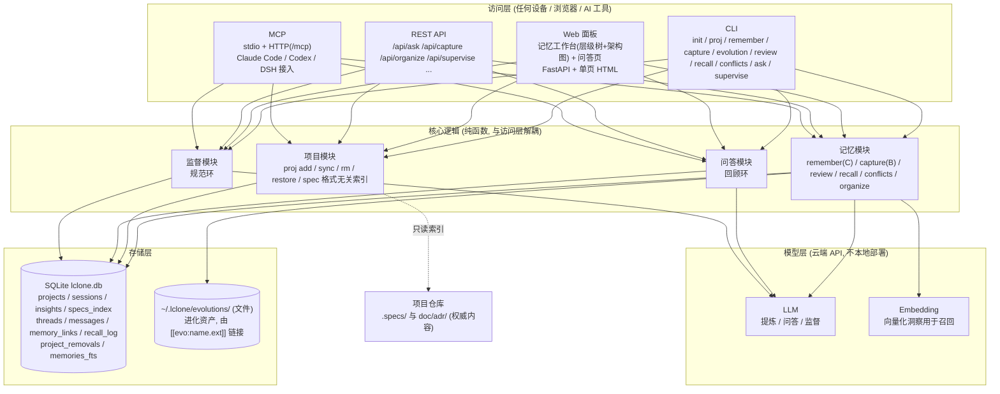

# 🧠 L-clone — 外置大脑 (External Brain)

> `中文` | [English](README.md)

[](LICENSE)

**L-clone** 是一个个人外置大脑:记录你做过什么,并在你规划未来时调用记忆、监督方案的边界条件。

## 它做了什么

- **分层记忆**:会话流水(L0)→ 洞察(L1)→ 项目 spec 索引(L2)
- **洞察而非流水账**:每条记忆是**原子化、自包含的知识卡**(一个决定/一条经验/一个观察/一条教训),按**四段卡**书写——*要点 ｜ 背景/为什么 ｜ 影响/以后注意 ｜ 归属*,独立可读
- **回顾环**:新会话自动召回相关洞察,回答"我上次做到哪、定了什么"
- **规范环**:新提议对照项目 spec 的边界条件,输出 ✅通过 / ⚠️警告 / ❌违反 检查报告
- **写入方式**:自动捕获(B, AI 提炼→你确认)与主动记忆(C, 你说算);**洞察一律经你盖章才生效**,每条可追溯来源
- **进化资产**:可复用的脚本/工具以**文件**形式存于 `~/.lclone/evolutions/`(不入数据库);洞察用 `[[evo:name.ext]]` 指向
- **准入与整理**:代码强制过滤"做了什么"(归 git/spec, 不进大脑)、**洞察矛盾检测**、`organize` 一键语义合并相近洞察
- **两轴竖向分层**:全局层 → 项目;具体事务留在仓库,大脑只管方向和决策
- **多端接入**:CLI + Web 面板 + REST API + MCP(Claude Code / Codex / DSH 插件),一条 `install` 向导接入

## 它解决了什么问题

模型是无状态的:下次对话,AI 不记得你上次的决定、项目的边界和规格。
L-clone 把"你做过什么、定过什么、约束是什么"沉淀为持久记忆,在每次新会话注入,
让 AI 的下一步工作建立在"你之前的决策"之上,而不是每次从零开始。

## 架构总览

L-clone 将**访问层**(CLI / Web / REST API / MCP)与**核心逻辑**(记忆 / 项目 / 问答 / 监督,纯函数)以及**存储层与模型层**分离:



> `BRAIN_LLM=dummy` 时模型层由内置离线后端替代, 无需网络与 API Key。

数据模型(ER)、写入/回顾/规范等流程与时序图、设计取舍,详见 [docs/CONCEPTS.md](docs/CONCEPTS.md)。

## 需要什么依赖

| 项 | 要求 |
|---|---|
| **Python** | **>= 3.10**(无需 GPU) |
| **第三方库** | `openai`(>=1.30)/ `fastapi`(>=0.110)/ `uvicorn`(>=0.29)/ `questionary`(>=2.0, 交互式菜单) |
| **数据库** | SQLite(内置,无需安装) |
| **网络** | 模型 API 需能访问 `BRAIN_BASE_URL`;国内装依赖推荐清华镜像 |
| **离线模式** | `BRAIN_LLM=dummy`:零第三方依赖、无需 API Key,可完整体验全部功能 |

安装:

```bash
python -m venv .venv
# Windows: .venv\Scripts\python.exe -m pip install -r requirements.txt -i https://pypi.tuna.tsinghua.edu.cn/simple
.venv/bin/python -m pip install -r requirements.txt -i https://pypi.tuna.tsinghua.edu.cn/simple
```

> 提示: 装依赖建议用 `python -m pip` 而不是 `.venv\Scripts\pip`——后者是启动器, venv 被移动/改名后会失效(`Fatal error in launcher`)。

> 部署后端服务用 **`lclone setup`**(选 provider + 填 key → 生成 `.env`、初始化数据库, **空项目起步**),不注册项目、不碰任何 AI 工具前端;接入 Claude Code / Codex / DSH 另用 **`lclone integrate`**。详见 [docs/CLI.md](docs/CLI.md)。

## 如何使用

### 一键体验(离线, 3 分钟, 零依赖)

```powershell
powershell -ExecutionPolicy Bypass -File .\scripts\demo_offline.ps1
```

### 一键部署(推荐)

```bash
# 本地(Windows / macOS / Linux 通用): 建 venv + 装依赖 + 接入向导 + 自检 + 启动 web
python scripts/deploy_local.py            # 交互式选 provider + 填 key
python scripts/deploy_local.py --offline  # 离线模式, 零依赖零 key
python scripts/deploy_local.py --mirror   # 国内用清华镜像装依赖

# 服务器(Linux + Docker): 交互生成 .env → docker compose up -d --build → 健康检查
./scripts/deploy_server.sh
```

### 手动流程

**第 1 步 — 离线模式先跑通**(无需 API Key):

```powershell
$env:BRAIN_LLM = "dummy"        # 离线模式
python -m lclone init
python -m lclone proj add demo examples/demo_project --charter "示例项目"
python -m lclone proj sync demo          # 扫描并索引项目里的 spec 文件
python -m lclone remember "后端用 FastAPI, 边界: 单用户" --project demo
#   ↑ 洞察默认进待确认; 加 --confirmed 直接生效, 或稍后 review 确认
python -m lclone capture "讨论后确定: 6月1日上线" --project demo
python -m lclone review --all keep       # 确认草稿 (或交互式: lclone review)
python -m lclone recall "FastAPI" --project demo
python -m lclone supervise "把数据库换成 PostgreSQL" --project demo
python -m lclone conflicts               # 找出互相矛盾的洞察对 (需真实 LLM 判定)
python -m lclone ask "我们项目定了什么?" --project demo
```

> 注意:`remember` 只写**洞察**(已无独立的 note 级——过程性事实记录并入了 evolution / git 侧)。要沉淀可复用脚本/工具,用 `lclone evolution add`。

**第 2 步 — 接入真实模型 API + Web 面板**:

```powershell
python -m lclone setup              # 部署后端: 选 provider + 填 key, 自动写 .env (推荐)
# 或手动: Copy-Item .env.example .env, 填 OPENAI_API_KEY / BRAIN_BASE_URL / 模型名 (见 docs/CLI.md)
python -m lclone doctor --check-llm  # 自检接入是否完整
.\.venv\Scripts\python.exe -m lclone web    # 浏览器打开 http://127.0.0.1:8000
# 后台常驻: lclone serve start / stop / status / restart
# 接入 Claude Code / Codex / DSH 等 AI 工具(可选, 单独命令): lclone integrate
```

### 记录与 Claude/AI 的对话

把对话内容粘给大脑,它自动提炼洞察(进草稿,你确认后生效):

```powershell
lclone capture "我想做个健身记录工具。Claude 建议: 用 Python + SQLite, 每周自动汇总, 先跑通再优化。我同意, 定于下月 1 号上线。"
lclone review --all keep        # 你过目后确认洞察草稿
lclone recall "健身工具"         # 下次直接想起
```

不想粘长对话?让 Claude 在结尾输出一行结论,然后:

```powershell
lclone remember "健身工具: Python+SQLite, 每周汇总, 下月1号上线" --confirmed   # 洞察当场已确认, 直接生效
```

> 记不清 `--confirmed` 也没关系:洞察不确认就进待确认,`lclone review` 再盖章同样生效。
> Web 面板「记忆工作台」的「待确认」按钮也可处理;接入 AI 工具(`lclone integrate` 配置 MCP / DSH 插件 / Claude Code hooks)后无需复制粘贴,自动沉淀。

### 完整自测(无需 API Key)

```bash
python tests/test_offline.py    # 90+ 项离线自测, 无需 API Key
```

## 文档索引

| 文档 | 内容 |
|---|---|
| [docs/CONCEPTS.md](docs/CONCEPTS.md) | 设计理念(分层、双环、洞察确认、进化资产)、Mermaid 图(数据模型/写入/回顾/规范/竖向)、生态、路线图 |
| [docs/CLI.md](docs/CLI.md) | CLI 完整命令参考、Web 面板与 REST API、模型 API 配置、环境变量 |
| [docs/DEPLOYMENT.md](docs/DEPLOYMENT.md) | 服务器部署(Docker + Caddy + 安全)与 MCP over HTTP |

## 开源协议

[LICENSE](LICENSE) · **MIT License** · Copyright (c) 2026 ljzRober
