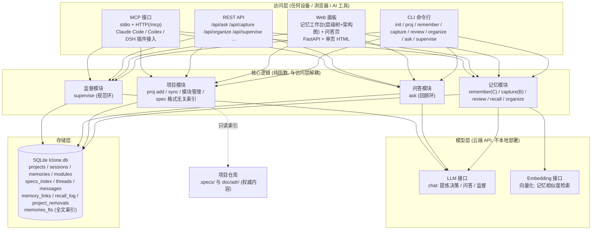
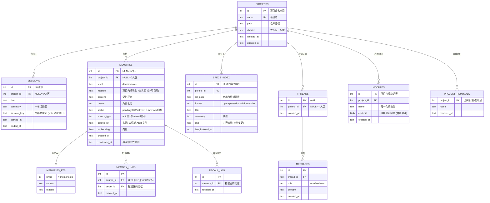
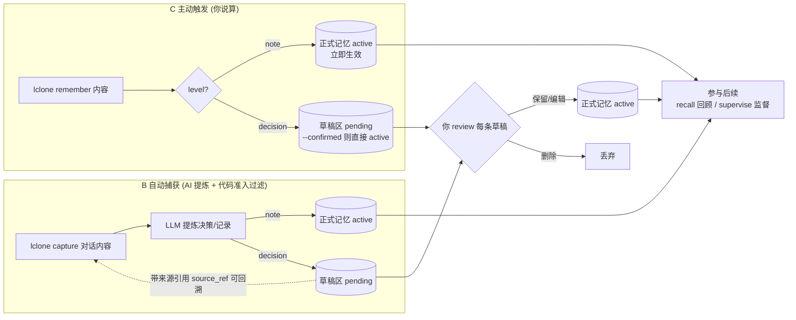
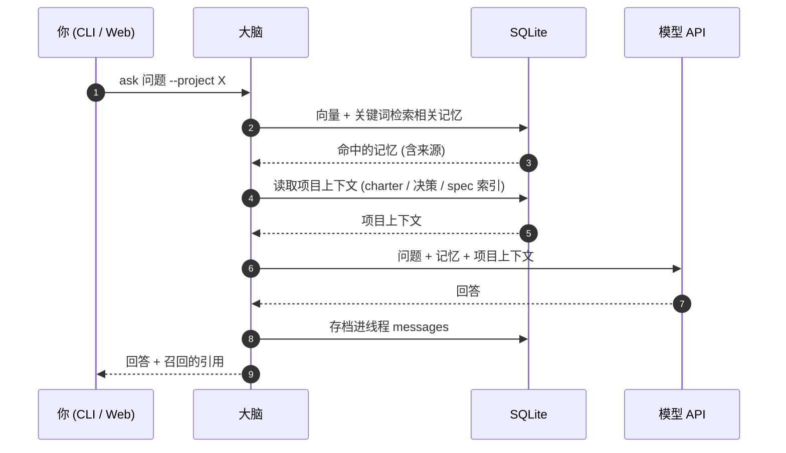
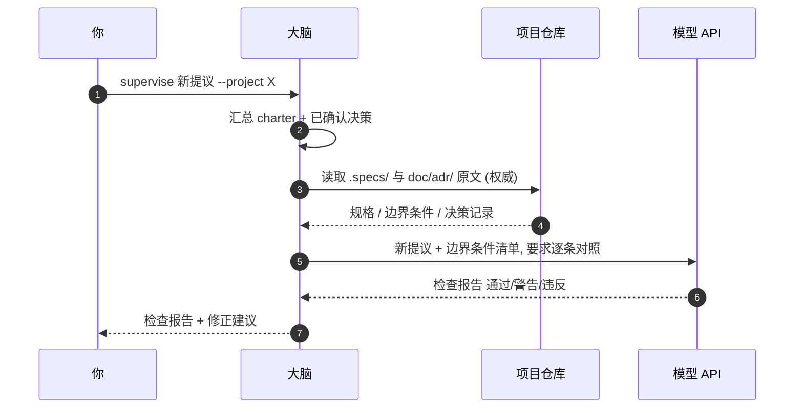
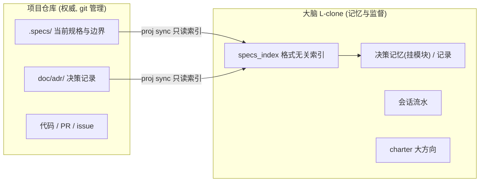

# 整体架构

> 回到 [README](../README.md) | 设计理念见 [DESIGN.md](DESIGN.md)
>
> 以下图表均为 Mermaid, 在 GitHub 上可直接渲染。

## 1. 系统架构图

> `BRAIN_LLM=dummy` 时模型层由内置离线后端替代, 无需网络与 API Key。

## 2. 数据存储结构 (ER 图)

## 3. 记忆写入流程 (决策强确认: B/C 统一待确认)

## 4. 回顾环 (新会话想起过去)

## 5. 规范环 (新提议对照边界条件)

## 6. 竖向分层: 大脑与项目的分工

> 具体事务 (spec 全文 / 代码 / PR) 永远留在项目仓库; 大脑只管大方向、
> 决策记忆、记录, 并在监督时引用仓库原文。
