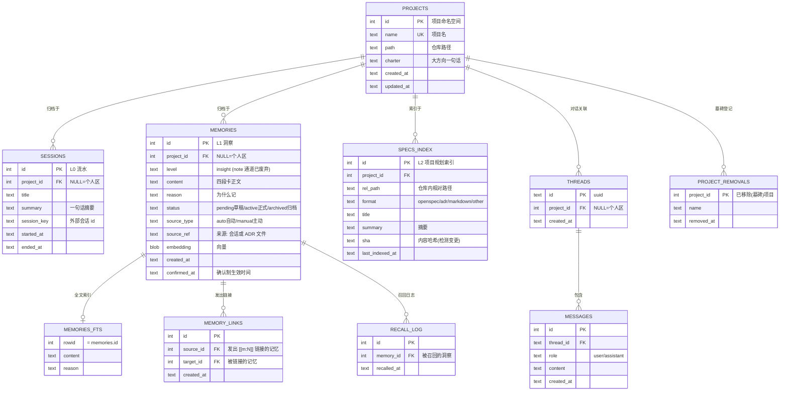
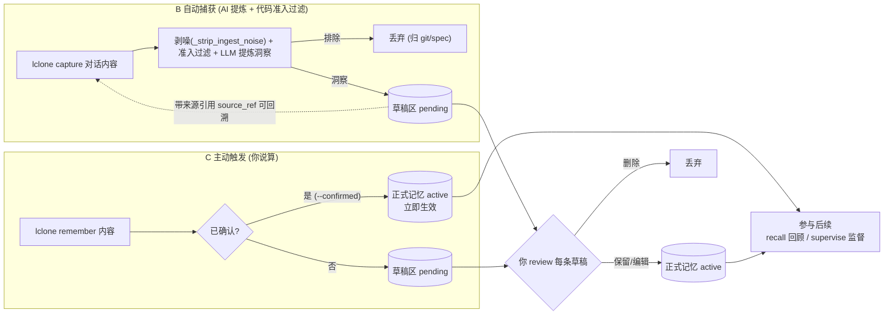
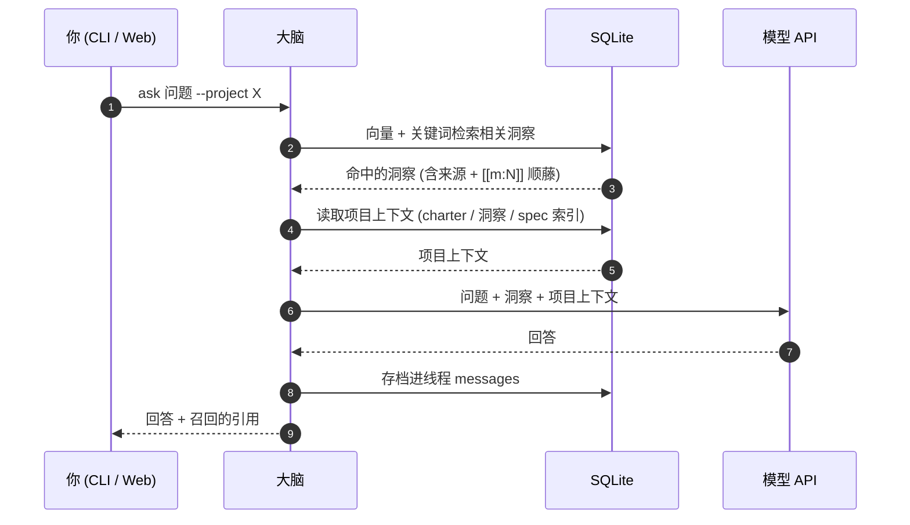
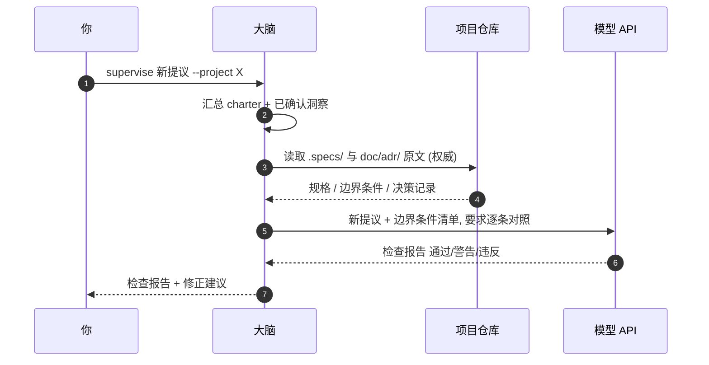
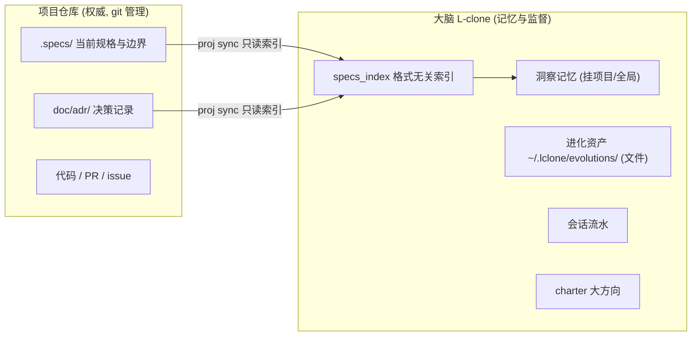

# 设计理念 Concepts

> 回到 [README](../README.md) | 架构总览见 [README](../README.md)
>
> 以下图表均为 Mermaid, 在 GitHub 上可直接渲染。

本文讲**为什么这么设计**,并把数据模型与各流程的图列全。架构总览(系统分层图)放在 README,避免重复。

## 1. 横向分层(记忆等级 × 时间)

```
L0 流水层   sessions      每次工作一句话摘要 (自动记录, 零打扰)
L1 洞察层   memories      洞察 (大脑的核心记忆, 原子化富知识卡)
L2 规划层   specs_index   项目内 spec 文件的索引 (权威内容在仓库)
```

## 2. 竖向分层(两轴: 项目 × 规格)

早期曾有「全局 → 项目 → 模块」三级,后**去掉 module 维度**——模块词表带来的整理成本高于收益,统一收敛为**两轴**:

- **项目轴**:每个项目一个命名空间 (`project_id`);`NULL` = 个人区/全局层(生命周期无限)。
  `promote`/`demote` 只是在项目轴上下移动 (改 `project_id`),不产生任何生命周期状态。
- **规格轴**:项目内 spec/决策/代码留在仓库,采用业界约定 (OpenSpec / ADR 等,格式可换——
  大脑按路径模式启发式识别,不绑定任何工具);大脑只索引、不存全文。

**分工边界(试金石: 能否改写成带 `WHEN…THEN…` 的 requirement)**:

| 内容 | 去向 |
|---|---|
| 能写成 `WHEN/THEN` 契约 (需求/场景/⚠️边界) | sp-spec (openspec), 随仓库版本化 |
| 代码改动/接口变化/新增端点/重构/修 bug | git |
| 决策理由/权衡/过程观察/经验教训 (写不成契约) | lclone 洞察 + 进化资产 |

**归属纪律**:一条洞察如果明确对应仓库内某具体 spec/文件,项目级记忆可标 `[[spec:id]]`/`[[src:path]]`
(link, not copy,权威内容留在仓库);全局级记忆无仓库上下文,不标此类链接(只有 `[[m:N]]`)。
一条记忆**升格为硬契约**时进 sp-spec,并写入 `[[spec:id]]` 引用或删除,避免双份漂移。

## 3. 洞察 (insight): 原子化富知识卡

**洞察 = 一条原子化、自包含、内容丰富的知识/见解/教训**——每条是一件事
(一个决定 / 一条经验 / 一个观察 / 一条复盘),**按四段卡书写(约 2-4 句)**:

```
要点        一句话核心
背景/为什么  为什么这么做 / 推理
影响/以后注意 后果 / 以后要注意什么
归属        仅项目级记忆写 (全局级无)
```

存储时按 `====` 分隔四段;整卡做 embedding。**不逐字转录对话/代码**(那是 git/spec),也不压成一行干结论。
太长就拆成多条洞察,一条一个观点。

**洞察强确认(统一规则)**:无论主动 (remember) 还是自动 (capture),**洞察一律进 pending 草稿,
你盖章后才生效**。`remember --confirmed` 表示当场已确认、直接生效;`remember` 不加 `--confirmed` 则进待确认。
原来分出「决策(decision)强确认 / 记录(note)免确认」两档,后统一为**洞察**一档——AI 提炼的内容都可能是权威结论
(可能幻觉/过度概括),统一"AI 写草稿、你盖章";过程性事实不再作为独立记忆类型,并入进化资产 / git 侧。

**准入过滤(代码强制,不依赖模型意图)**:

- 排除「做了什么」(修复/重构/改接口/修 bug) → 归 git 与 spec,不进记忆;
- 决策自筛:只提炼「定下选择/规则」,且用户提议被助手确认/落地才算;
  随口一提不提炼;标注 insight 但无决策信号自动降级;
- 过度琐碎(不足 4 字)的记录丢弃。

**ingest 剥噪**:`capture` 前先剥离宿主注入的标签块
(`<system-reminder>`/`<private>`/`<claude-mem-context>`/`<available_skills>`/`<injected>`/`<context>`),避免污染洞察。

## 4. 进化资产 (evolution) 与洞察分工

**进化资产 = 可复用脚本 / 工具**,实践某个具体事物时沉淀、会话中反复修改、不再修改即稳定。

- **存储**:以**文件**形式存于 `~/.lclone/evolutions/`(或 `LCLONE_EVO_DIR`),**不入 SQL 表**。
  - 项目无关的通用脚本/工具 → 内容直接写入文件;
  - 项目内脚本 → 只存路径引用(`ref`,内容留仓库、git 版本化)。
- **链接**:insight 用 `[[evo:name.ext]]` 指向某进化资产(insight→evolution),1..N 个 insight 可支撑一个 evolution;
  检索命中 insight 时顺带把该资产带出。脚本被改时用 `evolution update` 同步最新版本。

**记忆链接 `[[m:N]]`**:竖直两轴之外的第二张网。竖切分是默认归属;当记忆需要"跨层引用"时,
不必复制也不必搬动,在内容里写 `[[m:12]]` 即指向记忆 #12:

- 链接写入时解析存入 `memory_links` 表,跟随 `ON DELETE CASCADE` 自动清理;
- 召回命中 A 时自动顺藤把 A 链接指向的记忆一起带出(一层、限量,`recall --no-follow` 可关闭),
  不受竖向切分限制——这就是"共享上下文"的落点;
- `recall_log` 记录每次召回,支撑 `suggest` 的"长期未用"删除提示。

## 5. 两个回路

```
回顾环: 新会话 -> 召回相关洞察 + 项目上下文 -> 注入问答
规范环: 新提议 -> 调出项目 spec/边界 -> 逐条对照 -> ✅/⚠️/❌ 检查报告
```

## 6. 生命周期: 读取时决定, 不落状态字段

记忆没有"归档/未归档"之分,只有"加载/不加载"这一读取时决策:

- **全局层** (`project_id=NULL`, 个人区) 的记忆生命周期无限,永远加载。
- **项目记忆**的生命周期与所挂靠的项目绑定: 项目"活着"就加载。
- `proj rm` 是墓碑式移除: 不删行、不加 status 字段,只在 `project_removals` 登记移除事件。
  读取时 (recall/ask/proj list) 据此跳过已移除项目的记忆;数据保留,`proj restore` 可复活。
  真正删除由用户经 `suggest` 提示后手动决定。
- **上升/下降** (promote/demote) 只是改 `project_id`,不产生任何生命周期状态:
  - `promote`: 项目记忆 → 全局层 (多个项目要共读时)
  - `demote --project X`: 挂到指定项目 (不需要全局保持时; 也用于项目间横搬)

## 7. 矛盾检测

`lclone conflicts` 扫描 active 洞察,找出语义相近(向量相似度 ≥ 阈值)的候选对,
用 LLM 判定是否真矛盾(内容相反/规则改版/相冲突),输出 `{a, b, content_a, content_b, reason, hint}`。

- **只提示、不自动改**:是否处理由你决定(可经 review 删除/修订);
- dummy 后端无法判定矛盾时返回"无候选/未发现矛盾"。
- 目前为 **CLI 专用**(无对应 `/api/*` 端点)。

## 8. 整理合并 (organize) 与删除提示 (suggest)

**删除始终由用户决定**;算法只负责提示候选:疑似重复(向量相似度)/长期未确认草稿/长期未召回
(基于召回日志)/已移除项目的记忆。

`organize` 反向做「合并」:LLM 把语义相近、说的是同一件事的洞察合成一条综合描述,
硬约束为**同项目 + 同等级(insight)** 才可合并,跨区域由代码校验拒绝。

## 9. 数据存储结构 (ER 图)

> evolution 进化资产为**文件式**(`~/.lclone/evolutions/`),不在 SQL schema 内。



## 10. 记忆写入流程 (洞察强确认: B/C 统一待确认)



## 11. 回顾环 (新会话想起过去)



## 12. 规范环 (新提议对照边界条件)



## 13. 竖向分工: 大脑与项目的分工 (两轴)



> 具体事务 (spec 全文 / 代码 / PR) 永远留在项目仓库; 大脑只管大方向、洞察记忆、进化资产,
> 并在监督时引用仓库原文。

## 14. 与现有生态的关系

L-clone 不重复造轮子, 站在已有开源生态之上, 借鉴其思想并解决其缺口。

| 项目 | 借鉴点 | 我们的改进 |
|---|---|---|
| [GBrain](https://github.com/garrytan/gbrain) | Postgres 原生知识库: pages(编译真相)+ 时间线 | 用 SQLite 落地同思路: sessions + 版本化记忆 |
| [OpenSpec](https://github.com/Fission-AI/OpenSpec) | 项目内 `.specs/` 规格约定 | 兼容其目录约定, 但**格式无关**, 可换任意 spec 格式 |
| [ADR](https://realpython.com/ref/software-engineering-glossary/architecture-decision-record/) | `doc/adr/` 决策记录约定 | 大脑索引 ADR, 监督时引用原文 |
| [claude-mem](https://github.com/osamarehman/claude-mem) | 会话捕获 → 压缩 → 注入 | 机制已落地(MCP + hooks/插件), 且不绑定 Claude Code(MCP 通用) |
| [Mem0](https://vectorize.io/articles/mem0-vs-letta) | 对话 → 结构化记忆抽取 | 增加**洞察强确认**: AI 写草稿, 你盖章 |

**解决的问题**:

1. **AI 无状态**: 每次对话从零开始, 不记得你的决策 → 回顾环注入持久记忆
2. **AI 提炼不可信**: 全自动抽取会幻觉 → 洞察强确认(草稿 + 人工确认)
3. **spec 与记忆分离**: 具体事务留仓库(git 管真相), 大脑管跨会话记忆与监督
4. **生态锁定**: 不绑任何工具 —— MCP 接口(stdio + HTTP)+ DSH / Claude Code / Codex 插件 + OpenAI 兼容 API + 格式无关索引

**概念映射**:

| L-clone | 传统概念 |
|---|---|
| sessions(L0) | 工作日志 / changelog |
| insights(L1) | 决策记录 / ADR 摘要 / 经验卡 |
| specs_index(L2) | 项目规格索引 |
| supervise(规范环) | spec 合规检查 / 边界守卫 |
| recall(回顾环) | 记忆检索 / RAG |
| evolution | 可复用脚本 / 工具库 |

## 15. 路线图

### v0(已完成)

- 分层记忆(L0 流水 / L1 洞察 / L2 spec 索引)
- 回顾环(带记忆问答)与规范环(边界监督)
- **洞察强确认**(B/C 统一: 一律待确认) + 主动触发
- CLI + Web 面板(记忆工作台 + 问答) + REST API
- 两轴竖向分层: 全局层 → 项目 + 格式无关 spec 索引(已去掉 module 维度)
- **洞察四段卡** + ingest 剥噪 + 准入过滤/自筛(代码强制)
- **进化资产**(`~/.lclone/evolutions/` 文件式)+ `[[evo:]]` 链接
- **MCP server**(stdio + HTTP `/mcp`),Claude Code / Codex / DSH 插件接入
- **会话自动抽取**: hooks / 插件 → capture → 洞察待确认
- **记忆链接** `[[m:N]]` + 召回跟随
- 上升/下降(promote/demote)+ 项目墓碑(rm/restore)
- **冲突检测** (conflicts)+ 删除提示(suggest)+ 整理合并(organize)
- 接入向导(install)+ 自检(doctor)+ 在线备份(backup)+ web 服务化(serve)

### v1(规划中)

- [ ] **PostgreSQL + pgvector**: 多设备并发时替换 SQLite
- [ ] **定时学习任务**: 每日自动汇总项目状态, 主动提醒
- [ ] **更多触发面**: 更多 agent 环境的官方插件(当前 DSH 插件为「双面包」示例)

## 16. 设计取舍记录

| 决策 | 理由 |
|---|---|
| 记忆在服务器, 模型走 API | 数据可控 + 免 GPU 运维 + 永远用最新模型 |
| spec 权威留在项目仓库 | spec 是项目产物, 应随 git 版本化、可评审; 大脑只建索引 |
| 洞察强确认(B/C 统一) | 洞察是权威结论, 无论主动还是自动都"AI 写草稿、你盖章", 防幻觉 |
| 去掉 module 维度 | 模块词表维护成本 > 收益, 统一收敛为两轴(项目 × 规格) |
| 准入过滤代码强制 | "做了什么"归 git/spec, 记忆只留"定了什么规则/值得记的事实", 减少打扰 |
| insight 四段卡(非流水账) | 让大家能独立读懂一条洞察, 不依赖上下文; 也不逐字转录(那是 git/spec) |
| evolution 文件式 | 可复用资产本质是文件, 宜 git 版本化或存原文; 不入 SQL, 用 `[[evo:]]` 链接 |
| 格式无关 spec 索引 | 不绑定 OpenSpec/ADR 等任何工具, 按路径模式启发式识别 |
| 冲突检测只提示不自动改 | 记忆是权威结论, 是否删除/修订由用户决定 |
